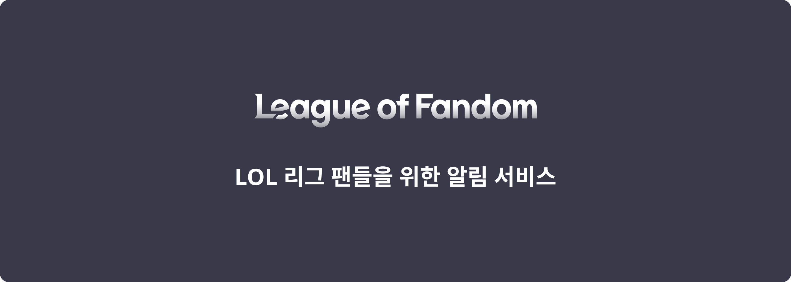
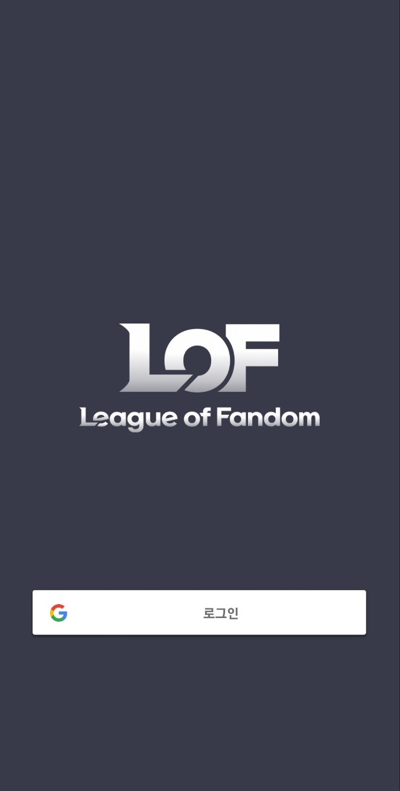
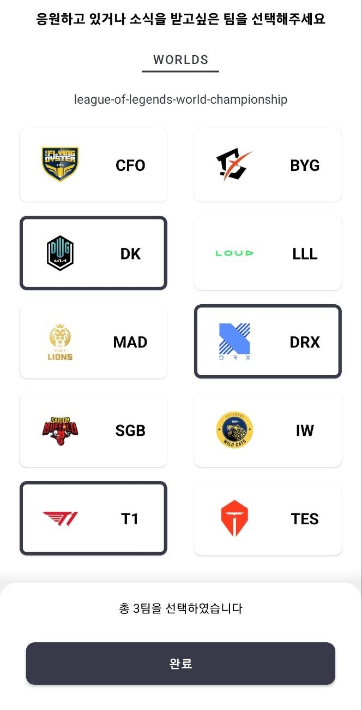
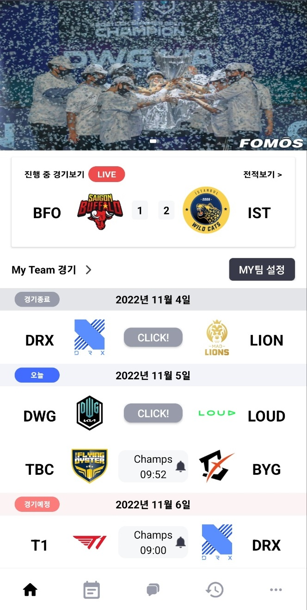
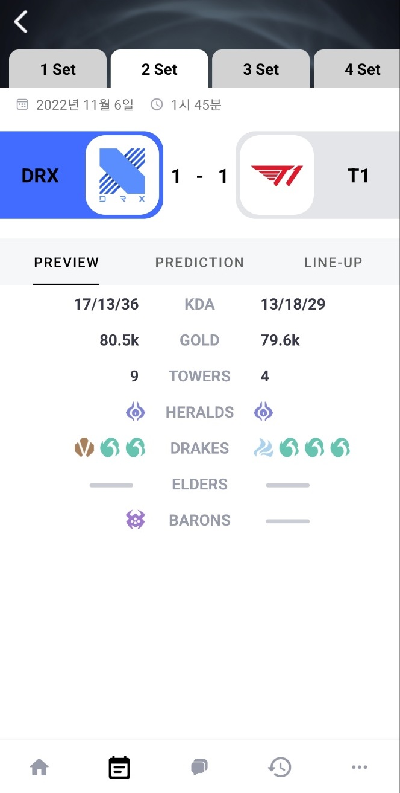
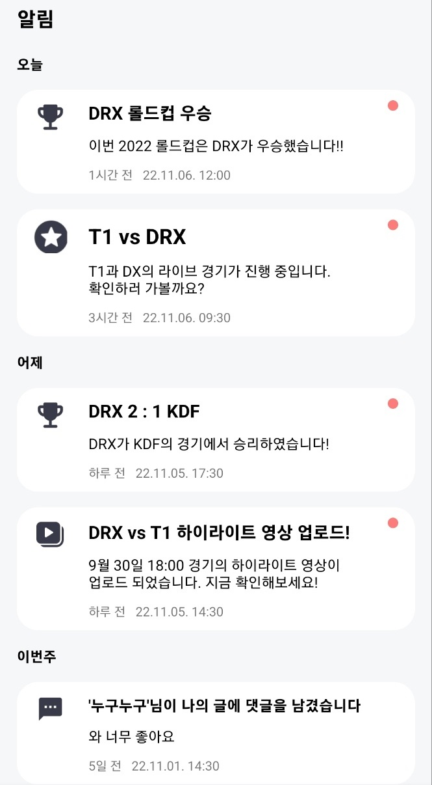
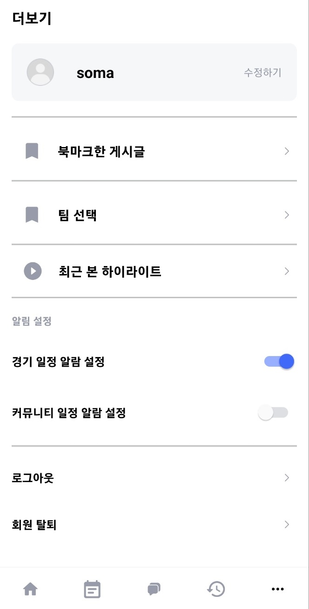

# League Of Fandom

<h2 id="0.5">
    <b>💁 Service introduce</b>
</h2>

### LoL 리그 팬들에게 경기시작 알림 및 정보를 제공하는 서비스

- 실시간으로 e-sports 경기 모니터링 시스템 구축, 사용자에게 적시에 정확한 경기정보 제공
- 각 경기별로 제공되는 데이터를 쉽게 파악할 수 있도록 제공

### Tech Stack
- `Kotlin`, `Jetpack`, `DataBinding`, `ViewModel`, `AAC`, `LiveData`, `OkHttp`, `Hilt`, `Timber`, `Glide`, `Coroutine`,  `Navigation Component`, `FCM`, `Firebase Analytics`, `i18n`

### ⚙️ Architecture
`MVVM`

## 팀구성

| Park                 | Name   |
| -------------------- | -------------|
| **Android** | <a href="https://github.com/JGeun">박정근</a>|
| **Back-end** | <a href="https://github.com/imygnam">남윤건</a>, <a href="https://github.com/summit45">이수민</a> |

  

  
  

  

  
  

  

